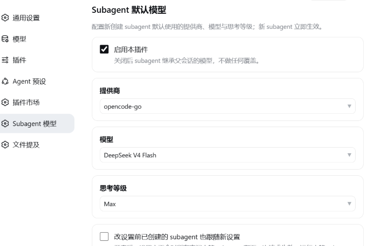

# dsh-subagent-setting

Configure the default **provider / model / reasoning effort** for subagents from the DeepSeek Harness Web settings page. Newly created subagents pick the values up immediately; an optional switch also lets later settings changes reach subagents that were created earlier.



## Features

- **Settings page** (Settings → Subagent Model): pick provider, model and reasoning effort from the live model catalog — no manual YAML editing.
- **New subagents use the new settings immediately** — the override is applied per child at creation time.
- **Optional live propagation** (Apply setting changes to subagents created earlier): when enabled, a settings change also updates every existing idle subagent — the new values apply on its next request (a running subagent picks them up from the next step). When disabled, only subagents created after the change are affected.
- **Empty provider / model / effort means *inherit the parent*** — the subagent keeps whatever the parent session uses.
- **WebView-friendly custom dropdowns**: the settings form uses fully controlled custom dropdowns instead of native `<select>` popups, so it behaves the same in the browser and inside a Tauri (WebView2) shell.

## How it works

- **Host** (`lib/index.js`) registers the `dsh-subagent-setting` settings namespace and, on `agent/created` for every agent whose session header has `origin: 'subagent'`, installs an agent-scoped `agent/request` waterfall listener that rewrites the call config to the configured route.
- The listener reads the child's live route holder, so `applyToIdle` only needs to replace that holder to re-point an existing child on its next request.
- **Client** (`client/client.js`) renders the settings section and talks to the official connection API (`settings.describe` / `settings.replace` /`llm.models`).

## Install

Install the package into your profile, then add it to the bundle list:

```sh
dsh plugin --profile web add github:marshfolx/dsh-subagent-setting
```

Open **Settings → Subagent Model** to configure the defaults.

## License

MIT
