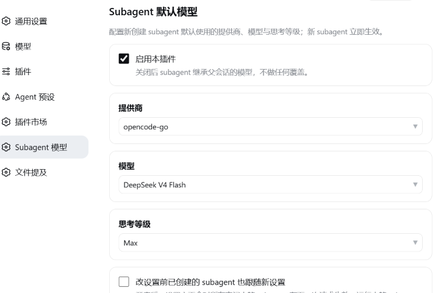

# dsh-subagent-setting

在 DeepSeek Harness 网页版的设置页里，可视化配置 subagent 默认使用的**提供商、模型与思考等级**。新创建的 subagent 立即生效；还可以选择让改设置之前已创建的 subagent 也跟随新设置。

要求 DSH **0.2.x**。



## 功能

- **设置页**（设置 → Subagent 模型）：从实时模型目录里选提供商、模型、思考等级，不用手改 YAML。
- **子 agent 可以和父会话用不同的模型**——这正是本插件存在的理由。父会话照常跑自己的模型，subagent 走你在这里指定的。
- **新 subagent 立即使用新设置**——路由在子 agent 创建时快照，之后只作用于它自己。
- **可选：对旧 subagent 生效**（`改设置前已创建的 subagent 也跟随新设置`）：开启后，设置变更会同步到所有已存在的空闲 subagent，下一次请求就用新值（运行中的 subagent 从下一步开始生效）；关闭则只影响之后新建的 subagent。
- 提供商 / 模型 / 思考等级留空 = **继承父会话**。三项全空时本插件完全不介入。
- **WebView 友好的自定义下拉框**：设置表单使用完全受控的自定义下拉组件，而非原生 `<select>` 弹层，因此在浏览器和 Tauri（WebView2）壳里表现一致。

## 工作原理

- **Host**（`lib/index.js`）插件本体就是一个 Config，五个字段全部标了 `volatile()`。0.2 的设置页只投影 volatile 字段，所以这个条目**自己就出现在设置文档里**，不再需要注册命名空间。
- 在 `agent/created` 时，对每个 `session.header.origin === 'subagent'` 的 agent，在它自己的作用域上装一个 `agent/request` 瀑布监听器，把最终的 `LlmCallConfig` 改写成配置的路由。作用域过滤保证它只收到这个子 agent 的事件。
- 监听器读取子 agent 的实时路由 holder，因此 `applyToIdle` 只需要替换该 holder 就能让已存在的子 agent 在下一次请求时重新指向。配置变化由加载器的 `loader/volatile-update` 事件通知。
- **思考等级按模型能力校验**：注入前先用 `llm.resolveModelInfo()` 查该路由实际支持的等级。设置页的下拉框用的是**同一个调用**（`remote.session.modelCatalog` → `buildModelCatalog`），所以两边永远不会不一致；模型确实不支持时宁可不发这个字段，也不会让请求被拒。
- 改了路由却没指定等级时，会丢掉从父会话继承来的等级，让新模型用自己的默认值——与官方子 agent 选项解析的规则一致。
- **Client**（`client/client.js`）通过 `ctx.configForms` 读写该条目，通过 `ctx.remote.session.modelCatalog()` 取模型目录，并用 `ctx.configForms.whileServed()` 保证只在宿主真的挂载了本插件时才显示这一页。

## 安装

```sh
dsh plugin --profile desktop add <spec>
```

也可以直接在侧边栏 **插件** 页里安装本地目录。包内声明了 `dsh.bundle.patch`，安装后会自动加入 profile 的 bundle 列表。

本插件的 Host 半边依赖 `@deepseek-ai/schemastery`（用于声明 Config schema）。第三方插件的模块解析看不到 DSH 自带的 `@deepseek-ai/*`，所以它被声明成**普通 dependency**，由 pnpm 从 npm 装进 profile，版本与运行时保持一致（3.18.4）。

装好后打开 **设置 → Subagent 模型** 即可配置。

## 已知限制

- **思考等级下拉框是否有内容，取决于模型是否声明了推理能力。** 在 `llm-pi-ai` 里手写的模型如果没写 `reasoningEfforts`，pi-ai 会把它当作"无推理元数据"，此时只提供"继承父会话"。要给这类模型开放等级，请在该 provider 的模型声明里补上 `reasoningEfforts`。
- 只在 Web 设置页可编辑；自动生成的插件配置页不会列出本条目（那套表单同样只投影 volatile 字段）。

## License

MIT
